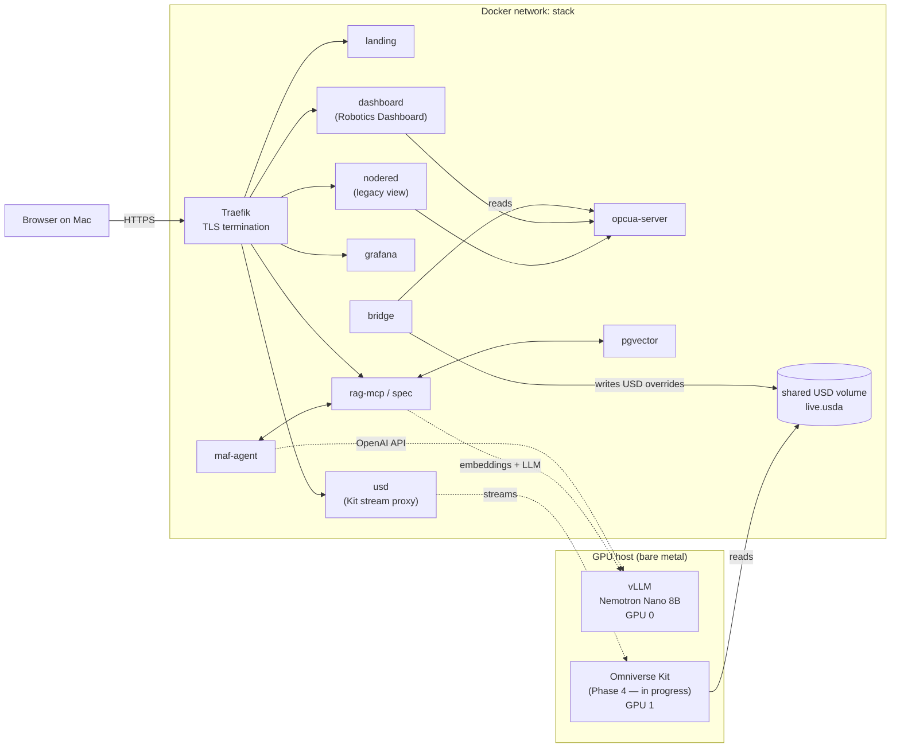
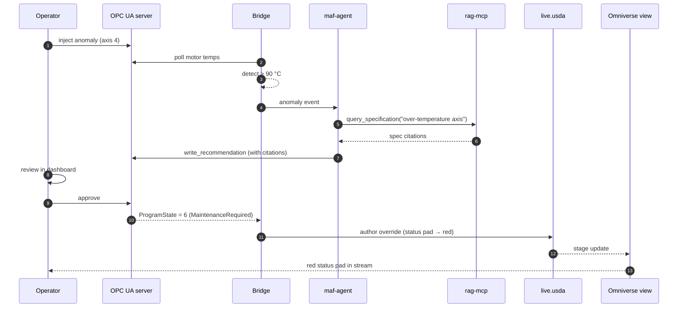

# Robot Digital Twin PoC

A containerized Industry-4.0 demo on a single GPU host that wires OPC UA, OpenUSD,
a RAG-grounded advisory agent, and (in progress) a streamed Omniverse view.


## Architecture



## URL map

| URL | Service | Status |
|---|---|---|
| `https://stack.local/` | Landing page | live |
| `https://stack.local/dashboard/` | Robotics Dashboard | live |
| `https://stack.local/nodered/` | Node-RED editor (legacy) | live |
| `https://stack.local/grafana/` | Grafana | live |
| `https://stack.local/spec/health` | RAG-MCP health | live |
| `https://stack.local/spec/api/specification/query` | RAG-MCP query API | live |
| `https://stack.local/usd/` | Omniverse Kit streaming view | in progress |
| `opc.tcp://stack.local:4840/axel/robot` | OPC UA endpoint | live |

Add `<HOST_IP>  stack.local` to your Mac's `/etc/hosts` (where `<HOST_IP>` is the
LAN address of the GPU host) and trust the self-signed CA from `traefik/certs/`.

## Robotics Dashboard

The custom dashboard at `/dashboard/` is the primary operator UI. It shows live
gauges per axis (position, velocity, torque), a motor-temperature chart with
threshold bands, a system-health ring summarising OPC UA / bridge / agent
liveness, and an in-app HITL approval panel where the operator reviews the
agent's spec-cited recommendation and signs off — that approval is what flips
`ProgramState` and triggers the USD override.

## Demo flow



## Quick start

```bash
cp .env.example .env                     # then fill in any 'changeme' values
./scripts/gen-certs.sh                   # one-time: self-signed CA + leaf cert
docker compose up -d                     # ≈10–15 min on first run (RAG embedding)
./scripts/healthcheck.sh                 # all green?
./scripts/demo-anomaly.sh                # walk the full anomaly story
```

## Host prerequisites

- Linux GPU host on the same LAN as the operator workstation
- Docker 29.4+, Docker Compose v2, NVIDIA Container Runtime registered
- 2× modern NVIDIA RTX-class GPUs (≥48 GB each recommended for an LLM + Kit)
- bare-metal vLLM serving an OpenAI-compatible API on `:8000` (model
  configurable via `VLLM_MODEL` in `.env`); the agent + RAG-MCP reach it via
  `host.docker.internal:8000` from inside the compose network

## Phase status

- [x] Phase 0 — Scaffolding (Traefik + landing page)
- [x] Phase 1a — OPC UA server (asyncua, simulator, anomaly injection)
- [x] Phase 1b — Node-RED legacy dashboard
- [x] Phase 1c — Robotics Dashboard (custom, primary operator UI)
- [x] Phase 2 — Bridge + USD authoring (≤200 ms write latency)
- [x] Phase 3 — InfluxDB + Telegraf + Grafana
- [x] Phase 5 — pgvector + RAG-MCP (14 273 chunks embedded from UA-for-AI-Prototype)
- [x] Phase 6 — Advisory agent (anomaly → spec → recommendation → HITL approval)
- [ ] Phase 4 — Omniverse Kit App Streaming (in progress; see [omniverse-kit/README.md](omniverse-kit/README.md))
- [x] Phase 7 — Polish, demo runbook, healthchecks

## GPU split

If vLLM uses both GPUs (tensor-parallel) it must be stopped before Omniverse
Kit can claim GPU 1. Restart vLLM with `--tensor-parallel-size 1` and
`CUDA_VISIBLE_DEVICES=0`; the agent and RAG-MCP keep working alongside the
viewer. A reference launcher is at `scripts/launch_vllm_nemotron_gpu0.sh`.

## Layout

```
OPCUA-OpenUSD/
├── docker-compose.yml          # all services
├── .env.example                # environment template
├── traefik/                    # Traefik static + dynamic config
├── landing-page/               # nginx-served entry page
├── dashboard/                  # Robotics Dashboard (primary operator UI)
├── opcua-server/               # asyncua robot simulator
├── opcua-nodered/              # legacy Node-RED image with pre-built flows
├── bridge/                     # OPC UA → USD authoring service
├── usd-assets/                 # stage.usda, robot.usda, cell.usda, live.usda
├── telegraf/                   # OPC UA → InfluxDB
├── grafana/provisioning/       # datasource + dashboard
├── pgvector/                   # pgvector pg16 + init.sql
├── rag-mcp/                    # FastAPI + sentence-transformers + MCP-SSE
├── maf-agent/                  # anomaly-driven advisory agent
├── omniverse-kit/              # Phase 4 (in progress)
├── docs/                       # screenshots, diagrams (drop-in)
└── scripts/                    # gen-certs, healthcheck, demo-anomaly
```
