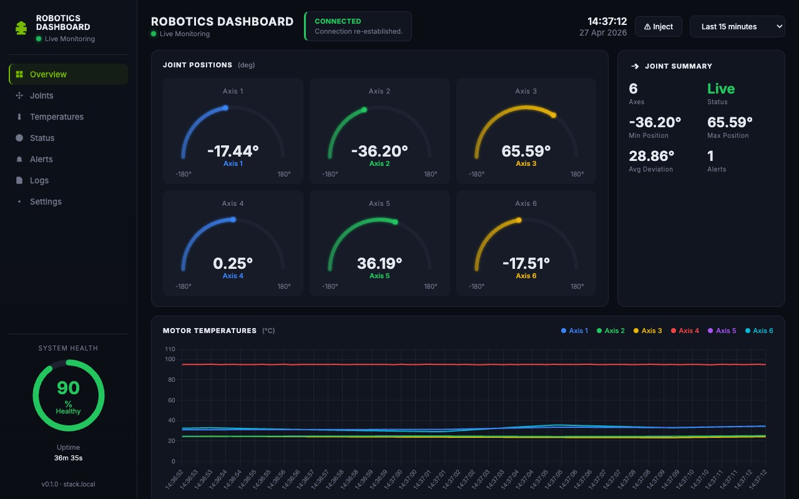
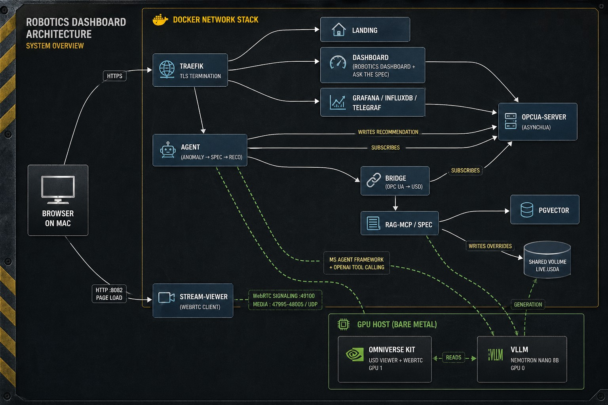
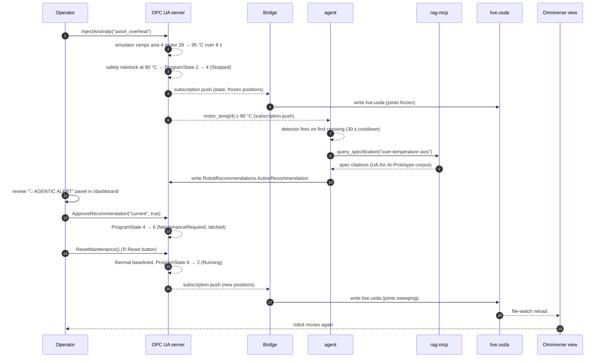
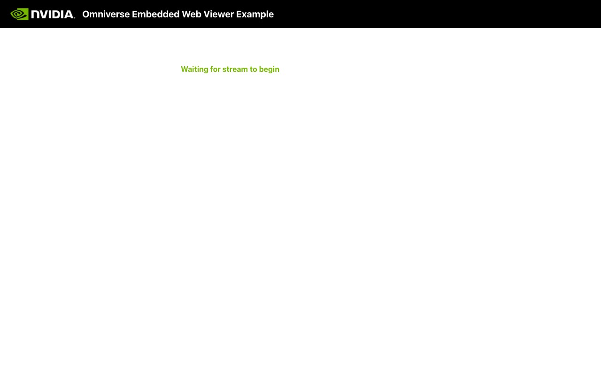
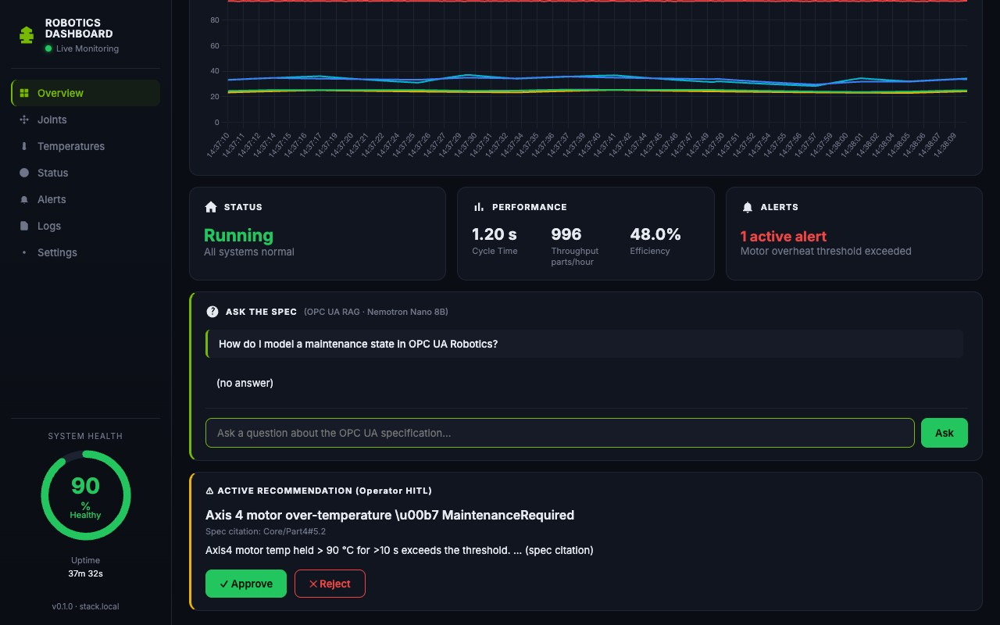

# Robot Digital Twin PoC

A containerized Industry 4.0 demo on a single Linux GPU host that wires
**OPC UA**, **OpenUSD**, a **RAG-grounded advisory agent**, and a **streamed
Omniverse Kit view**. All services run from one `docker compose up`.



## Architecture



The Mac browser drives two flows: HTTPS to Traefik for the dashboard, Grafana,
landing page, and spec API; plain HTTP to `stream-viewer` (port 8082), which
opens a WebRTC handshake directly to Omniverse Kit on GPU 1 (signaling on
`:49100`, media on UDP `47995–48005`). Inside the compose network the agent
subscribes to OPC UA, runs anomaly detection against motor temperatures, queries
the RAG-MCP service (which embeds the OPC UA spec corpus into pgvector and
generates citations through vLLM), and writes spec-cited recommendations back
to a separate OPC UA namespace. The bridge is a deterministic one-way mapper:
OPC UA → USD overrides on a shared volume that both the bridge and the
Omniverse Kit container read.

## URL map

| URL | Service | Status |
|---|---|---|
| `https://stack.local/` | Landing page | ✓ |
| `https://stack.local/dashboard/` | **Robotics Dashboard** (primary operator UI) | ✓ |
| `https://stack.local/grafana/` | Grafana time-series | ✓ |
| `https://stack.local/spec/health` | RAG-MCP health | ✓ |
| `https://stack.local/spec/api/specification/query` | RAG-MCP HTTP API | ✓ |
| `http://stack.local:8082/` | NVIDIA WebRTC viewer (loads the Kit stream) | ✓ |
| `opc.tcp://stack.local:4840/axel/robot` | OPC UA endpoint | ✓ |

Add `<HOST_IP>  stack.local` to your Mac's `/etc/hosts` and trust the self-signed
CA from `traefik/certs/rootCA.crt`.

## OPC UA in this PoC

[OPC UA](https://opcfoundation.org/about/opc-technologies/opc-ua/) is the
de-facto standard for vendor-neutral data exchange in industrial automation.
A *server* hosts a typed **address space** of objects, variables, and methods;
*clients* (HMIs, MES, PLCs, agents) browse, read, write, subscribe, or call
methods over `opc.tcp://`. We use the open-source Python implementation
[`asyncua`](https://github.com/FreeOpcUa/opcua-asyncio) on the server side and
wherever a Python client connects.

### Address space exposed by `opcua-server`

Two namespaces:

```
ns=2  urn:axel:robot                                (process variables)
└── RobotController
    ├── Identification/   Manufacturer, Model, SerialNumber          (read-only)
    ├── MotionDevice/
    │   └── Axis1..Axis6/
    │       ├── ActualPosition          (Double, deg, [-180..180])
    │       ├── ActualSpeed             (Double, deg/s)
    │       ├── ActualTemperature       (Double, °C)
    │       └── MotorTemperature        (Double, °C)
    ├── Tool/             GripperState (Bool), PayloadKg (Double)
    ├── ProgramState      (Int32 — PackML-flavoured enum, see below)
    ├── CycleCounter      (UInt64)
    └── TaskControl/
        ├── ResetMaintenance   ()       → StatusCode
        └── InjectAnomaly      (String) → StatusCode

ns=3  urn:axel:robot:recommendations                (agent advisory channel)
└── RobotRecommendations
    ├── ActiveRecommendation             (String, JSON-encoded)
    ├── RecommendationCount              (UInt32)
    └── ApproveRecommendation (id String, approved Boolean) → StatusCode
```

`ProgramState` enum:
`0 Idle · 1 Starting · 2 Running · 3 Stopping · 4 Stopped · 5 Aborted · 6 MaintenanceRequired`.

Every node uses an explicit **string NodeId** (e.g.
`ns=2;s=RobotController.MotionDevice.Axis1.ActualPosition`) so external clients
(Telegraf, dashboards, the agent) can address them by name without browsing.

### Endpoints

The server advertises three endpoint security combinations on the same TCP
port (`4840`):

| Policy | Mode | Auth |
|---|---|---|
| `None` | None | Anonymous (read-only) |
| `Basic256Sha256` | `Sign` | UserName |
| `Basic256Sha256` | `SignAndEncrypt` | UserName |

The simulator generates a self-signed application instance certificate on first
boot (`opcua-server/entrypoint.sh`).

### Who talks to the server

| Client | Direction | Why |
|---|---|---|
| `bridge` | subscribe | mirrors axis positions + motor temps into `live.usda` |
| `agent` | subscribe + method-call + write | anomaly detection on motor temps; writes spec-cited recommendations to `RobotRecommendations`; calls `ApproveRecommendation` for HITL closure |
| `dashboard` | subscribe | drives the operator gauges, chart, status pill |
| `telegraf` | subscribe | pushes every variable into InfluxDB for Grafana |
| `Robotics Dashboard "Inject" button` | method-call | invokes `InjectAnomaly` to ramp axis-4 motor temp for a demo |

## Demo flow

A step-by-step walkthrough lives in [`docs/DEMO.md`](docs/DEMO.md). The
condensed sequence:





The 3D scene streamed at `http://stack.local:8082/` — a 6-axis robot
articulated chain on a grey cell floor, the blue pickup station and green
dropoff station, the green status pad (turns red on `MaintenanceRequired`),
and the four yellow fence corner posts. The bridge writes joint rotations and
material colours into `live.usda` at 10 Hz; the Kit App reloads the layer on
file-watch and the WebRTC track surfaces the change in &lt;500 ms.

## Robotics Dashboard

The dashboard at `/dashboard/` is the primary operator UI:

- six SVG semicircle gauges with glow + animated needle for axis positions
- a multi-series Chart.js motor-temperature chart with a 90 °C threshold band
- system-health ring (drops with overheats), uptime, status pill
- **Ask the Spec** chat panel — type any OPC UA question, get a Nemotron answer
  grounded in the embedded UA-for-AI-Prototype corpus with `[Part#chunk]` citations
- in-app HITL approval panel — when the agent writes a recommendation, an
  Approve / Reject card appears; clicking Approve calls `ApproveRecommendation`
  on the OPC UA server which applies the recommended action



Above the fold the operator sees gauges + temperatures; below it the
performance / alerts row, the spec chat, and the HITL recommendation card.

## Advisory agent

The agent (service `maf-agent`) is built on the
[Microsoft Agent Framework](https://github.com/microsoft/agent-framework)
(GA, `agent-framework` 1.2.0). It uses `agent_framework.Agent` with the
**`OpenAIChatCompletionClient`** (the stateless `chat.completions` variant —
vLLM doesn't persist OpenAI's stateful `response_id`s) pointed at the
bare-metal vLLM.

vLLM serves **`nvidia/NVIDIA-Nemotron-3-Nano-30B-A3B-FP8`** by default — a
30 B-parameter Mamba2 + Transformer hybrid MoE that activates only ~3.5 B
parameters per token, fits on GPU 0 (~41 GB used incl. KV cache) on a single
RTX 6000 Ada, and ships native tool calling (BFCL v4 ≈ 53, MMLU-Pro 78,
AIME25-with-tools 99). Launch flags:

```
--tool-call-parser qwen3_coder
--reasoning-parser nano_v3 --reasoning-parser-plugin scripts/nano_v3_reasoning_parser.py
--kv-cache-dtype fp8
--trust-remote-code
```

The thinking trace is toggled per request via
`chat_template_kwargs.enable_thinking=False` so the recommendation arrives as
a single fast tool call. A reference launcher lives at
[`scripts/launch_vllm_nemotron3_gpu0.sh`](scripts/launch_vllm_nemotron3_gpu0.sh)
and the parser plugin (vendored from the model card) at
[`scripts/nano_v3_reasoning_parser.py`](scripts/nano_v3_reasoning_parser.py).

Two `@tool` functions:

- `query_specification(question, part_filter)` — proxies through the
  `rag-mcp` HTTP API (`/spec/api/specification/query`) to retrieve
  spec-grounded answers with `[Part#chunk]` citations
- `write_recommendation_to_opcua(title, rationale, actions, spec_citation)`
  — opens an authenticated `asyncua` client to the OPC UA server and
  writes the recommendation into the `RobotRecommendations.ActiveRecommendation`
  variable

Both tools are `approval_mode="never_require"`. The HITL is **out-of-band**:
the operator clicks Approve in the Robotics Dashboard, which calls the
OPC UA `ApproveRecommendation` method — that's what actually applies the
recommended state change. The agent's role is strictly advisory.

The agent has the contract:

- never writes to process variables (axis positions, temperatures, etc.)
- only publishes to `RobotRecommendations`
- the operator approval is what triggers `ProgramState` change — no agent
  authority to bypass

## Quick start

```bash
cp .env.example .env                     # fill in any 'changeme' values
./scripts/gen-certs.sh                   # one-time: self-signed CA + leaf cert
docker compose up -d                     # ≈10–15 min on first run (RAG embedding)
./scripts/healthcheck.sh                 # all green?
./scripts/demo-anomaly.sh                # walk the full anomaly story
```

## Host prerequisites

- Linux GPU host on the same LAN as the operator workstation
- Docker 29.4+, Docker Compose v2, NVIDIA Container Runtime registered
- 2× modern NVIDIA RTX-class GPUs (≥48 GB each recommended)
- bare-metal vLLM on `:8000` (`VLLM_MODEL` in `.env`); containers reach it via
  `host.docker.internal:8000`. Default model:
  `nvidia/NVIDIA-Nemotron-3-Nano-30B-A3B-FP8` on GPU 0; launcher at
  `scripts/launch_vllm_nemotron3_gpu0.sh` (also vendors the
  `nano_v3_reasoning_parser.py` plugin from the model card).
- GPU 1 is reserved for the Omniverse Kit container

## Phase status

- [x] Phase 0 — Scaffolding (Traefik + landing page)
- [x] Phase 1a — OPC UA server (asyncua, simulator, anomaly injection)
- [x] Phase 1b — Robotics Dashboard (custom, primary operator UI; Ask-the-Spec chat panel)
- [x] Phase 2 — Bridge + USD authoring (≤200 ms write latency)
- [x] Phase 3 — InfluxDB + Telegraf + Grafana
- [x] Phase 4 — Omniverse Kit + WebRTC stream viewer
- [x] Phase 5 — pgvector + RAG-MCP (14 273 chunks embedded from UA-for-AI-Prototype)
- [x] Phase 6 — Advisory agent (anomaly → spec → recommendation → HITL approval)
- [x] Phase 7 — Polish, demo runbook, healthchecks

## Layout

```
OPCUA-OpenUSD/
├── docker-compose.yml          # all services
├── .env.example                # environment template
├── traefik/                    # Traefik static + dynamic config
├── landing-page/               # nginx-served entry page
├── dashboard/                  # Robotics Dashboard (primary operator UI)
├── opcua-server/               # asyncua robot simulator
├── bridge/                     # OPC UA → USD authoring
├── usd-assets/                 # stage.usda, robot.usda, cell.usda, live.usda
├── telegraf/                   # OPC UA → InfluxDB
├── grafana/provisioning/       # datasource + dashboard
├── pgvector/                   # pgvector pg16 + init.sql
├── rag-mcp/                    # FastAPI + sentence-transformers + spec query
├── maf-agent/                  # advisory agent (Microsoft Agent Framework)
├── omniverse-kit/              # Phase 4: Kit App + WebRTC streaming
├── docs/                       # screenshots, diagrams (drop-in)
└── scripts/                    # gen-certs, healthcheck, demo-anomaly,
                                # launch_vllm_nemotron3_gpu0,
                                # nano_v3_reasoning_parser
```
