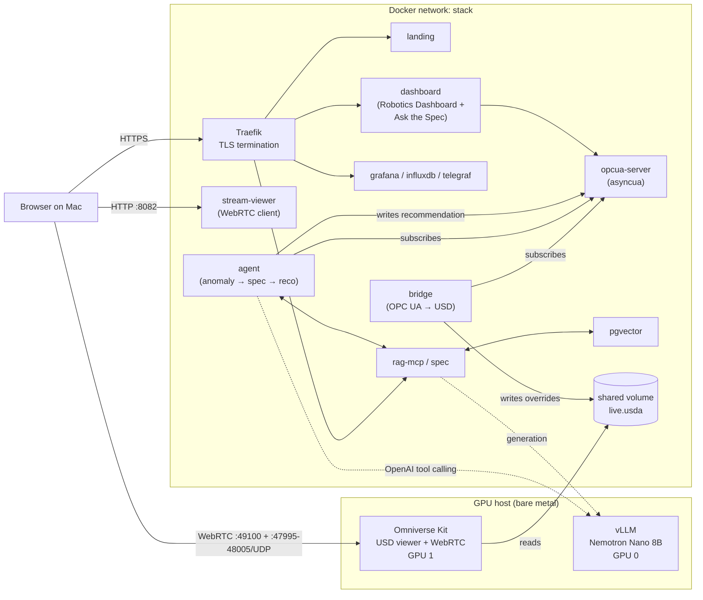
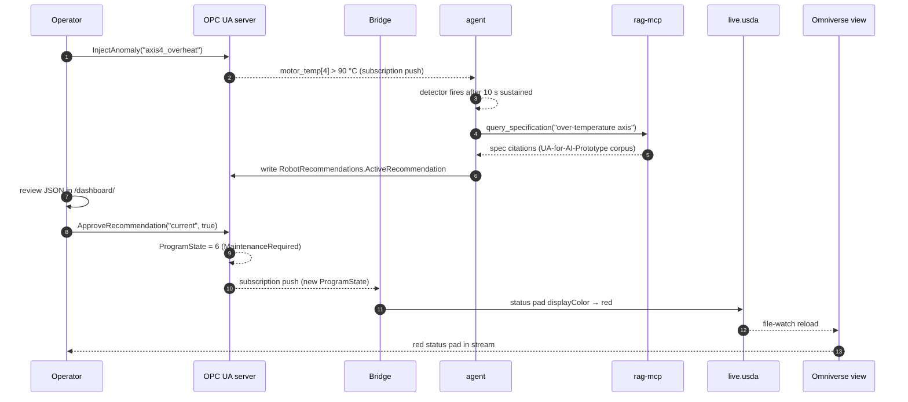

# Robot Digital Twin PoC

A containerized Industry 4.0 demo on a single Linux GPU host that wires
**OPC UA**, **OpenUSD**, a **RAG-grounded advisory agent**, and a **streamed
Omniverse Kit view**. All twelve services run from one `docker compose up`.


## Architecture



## URL map

| URL | Service | Status |
|---|---|---|
| `https://stack.local/` | Landing page | ✓ |
| `https://stack.local/dashboard/` | **Robotics Dashboard** (primary operator UI) | ✓ |
| `https://stack.local/grafana/` | Grafana time-series | ✓ |
| `https://stack.local/spec/health` | RAG-MCP health | ✓ |
| `https://stack.local/spec/api/specification/query` | RAG-MCP HTTP API | ✓ |
| `http://stack.local:8082/` | NVIDIA WebRTC viewer (loads the Kit stream) | ✓ |
| `opc.tcp://stack.local:4840/axel/robot` | OPC UA endpoint | ✓ |

Add `<HOST_IP>  stack.local` to your Mac's `/etc/hosts` and trust the self-signed
CA from `traefik/certs/rootCA.crt`.

## OPC UA in this PoC

[OPC UA](https://opcfoundation.org/about/opc-technologies/opc-ua/) is the
de-facto standard for vendor-neutral data exchange in industrial automation.
A *server* hosts a typed **address space** of objects, variables, and methods;
*clients* (HMIs, MES, PLCs, agents) browse, read, write, subscribe, or call
methods over `opc.tcp://`. We use the open-source Python implementation
[`asyncua`](https://github.com/FreeOpcUa/opcua-asyncio) on the server side and
wherever a Python client connects.

### Address space exposed by `opcua-server`

Two namespaces:

```
ns=2  urn:axel:robot                                (process variables)
└── RobotController
    ├── Identification/   Manufacturer, Model, SerialNumber          (read-only)
    ├── MotionDevice/
    │   └── Axis1..Axis6/
    │       ├── ActualPosition          (Double, deg, [-180..180])
    │       ├── ActualSpeed             (Double, deg/s)
    │       ├── ActualTemperature       (Double, °C)
    │       └── MotorTemperature        (Double, °C)
    ├── Tool/             GripperState (Bool), PayloadKg (Double)
    ├── ProgramState      (Int32 — PackML-flavoured enum, see below)
    ├── CycleCounter      (UInt64)
    └── TaskControl/
        ├── ResetMaintenance   ()       → StatusCode
        └── InjectAnomaly      (String) → StatusCode

ns=3  urn:axel:robot:recommendations                (agent advisory channel)
└── RobotRecommendations
    ├── ActiveRecommendation             (String, JSON-encoded)
    ├── RecommendationCount              (UInt32)
    └── ApproveRecommendation (id String, approved Boolean) → StatusCode
```

`ProgramState` enum:
`0 Idle · 1 Starting · 2 Running · 3 Stopping · 4 Stopped · 5 Aborted · 6 MaintenanceRequired`.

Every node uses an explicit **string NodeId** (e.g.
`ns=2;s=RobotController.MotionDevice.Axis1.ActualPosition`) so external clients
(Telegraf, dashboards, the agent) can address them by name without browsing.

### Endpoints

The server advertises three endpoint security combinations on the same TCP
port (`4840`):

| Policy | Mode | Auth |
|---|---|---|
| `None` | None | Anonymous (read-only) |
| `Basic256Sha256` | `Sign` | UserName |
| `Basic256Sha256` | `SignAndEncrypt` | UserName |

The simulator generates a self-signed application instance certificate on first
boot (`opcua-server/entrypoint.sh`).

### Who talks to the server

| Client | Direction | Why |
|---|---|---|
| `bridge` | subscribe | mirrors axis positions + motor temps into `live.usda` |
| `agent` | subscribe + method-call + write | anomaly detection on motor temps; writes spec-cited recommendations to `RobotRecommendations`; calls `ApproveRecommendation` for HITL closure |
| `dashboard` | subscribe | drives the operator gauges, chart, status pill |
| `telegraf` | subscribe | pushes every variable into InfluxDB for Grafana |
| `Robotics Dashboard "Inject" button` | method-call | invokes `InjectAnomaly` to ramp axis-4 motor temp for a demo |

## Demo flow



## Robotics Dashboard

The dashboard at `/dashboard/` is the primary operator UI:

- six SVG semicircle gauges with glow + animated needle for axis positions
- a multi-series Chart.js motor-temperature chart with a 90 °C threshold band
- system-health ring (drops with overheats), uptime, status pill
- **Ask the Spec** chat panel — type any OPC UA question, get a Nemotron answer
  grounded in the embedded UA-for-AI-Prototype corpus with `[Part#chunk]` citations
- in-app HITL approval panel — when the agent writes a recommendation, an
  Approve / Reject card appears; clicking Approve calls `ApproveRecommendation`
  on the OPC UA server which applies the recommended action

## Advisory agent (note on framework)

The agent (service `agent`, code in `maf-agent/`) was originally specified to
use the [Microsoft Agent Framework](https://github.com/microsoft/agent-framework)
(`agent-framework[openai] --pre`). For the PoC we use **plain OpenAI tool
calling** with `openai.AsyncOpenAI` pointed at the bare-metal vLLM. vLLM is
launched with `--enable-auto-tool-choice --tool-call-parser llama3_json`, which
is what makes Llama-3.1-Nemotron-Nano-8B return `tool_calls` on the
OpenAI-compatible endpoint. Functionally equivalent to MAF for this two-tool
flow (`query_specification`, `write_recommendation_to_opcua`); the directory
name `maf-agent/` is left for git history.

The agent has the same advisory contract MAF would enforce:

- never writes to process variables (axis positions, temperatures, etc.)
- only publishes to `RobotRecommendations`
- the operator approval is what triggers `ProgramState` change — no agent
  authority to bypass

## Quick start

```bash
cp .env.example .env                     # fill in any 'changeme' values
./scripts/gen-certs.sh                   # one-time: self-signed CA + leaf cert
docker compose up -d                     # ≈10–15 min on first run (RAG embedding)
./scripts/healthcheck.sh                 # all green?
./scripts/demo-anomaly.sh                # walk the full anomaly story
```

## Host prerequisites

- Linux GPU host on the same LAN as the operator workstation
- Docker 29.4+, Docker Compose v2, NVIDIA Container Runtime registered
- 2× modern NVIDIA RTX-class GPUs (≥48 GB each recommended)
- bare-metal vLLM on `:8000` (`VLLM_MODEL` in `.env`); containers reach it via
  `host.docker.internal:8000`. Tested with `nvidia/Llama-3.1-Nemotron-Nano-8B-v1`
  on GPU 0; sample launcher at `scripts/launch_vllm_nemotron_gpu0.sh`.
- GPU 1 is reserved for the Omniverse Kit container

## Phase status

- [x] Phase 0 — Scaffolding (Traefik + landing page)
- [x] Phase 1a — OPC UA server (asyncua, simulator, anomaly injection)
- [x] Phase 1b — Robotics Dashboard (custom, primary operator UI; Ask-the-Spec chat panel)
- [x] Phase 2 — Bridge + USD authoring (≤200 ms write latency)
- [x] Phase 3 — InfluxDB + Telegraf + Grafana
- [x] Phase 4 — Omniverse Kit + WebRTC stream viewer
- [x] Phase 5 — pgvector + RAG-MCP (14 273 chunks embedded from UA-for-AI-Prototype)
- [x] Phase 6 — Advisory agent (anomaly → spec → recommendation → HITL approval)
- [x] Phase 7 — Polish, demo runbook, healthchecks

## Layout

```
OPCUA-OpenUSD/
├── docker-compose.yml          # all services
├── .env.example                # environment template
├── traefik/                    # Traefik static + dynamic config
├── landing-page/               # nginx-served entry page
├── dashboard/                  # Robotics Dashboard (primary operator UI)
├── opcua-server/               # asyncua robot simulator
├── bridge/                     # OPC UA → USD authoring
├── usd-assets/                 # stage.usda, robot.usda, cell.usda, live.usda
├── telegraf/                   # OPC UA → InfluxDB
├── grafana/provisioning/       # datasource + dashboard
├── pgvector/                   # pgvector pg16 + init.sql
├── rag-mcp/                    # FastAPI + sentence-transformers + spec query
├── maf-agent/                  # advisory agent (OpenAI tool calling, see note)
├── omniverse-kit/              # Phase 4: Kit App + WebRTC streaming
├── docs/                       # screenshots, diagrams (drop-in)
└── scripts/                    # gen-certs, healthcheck, demo-anomaly,
                                # launch_vllm_nemotron_gpu0
```
