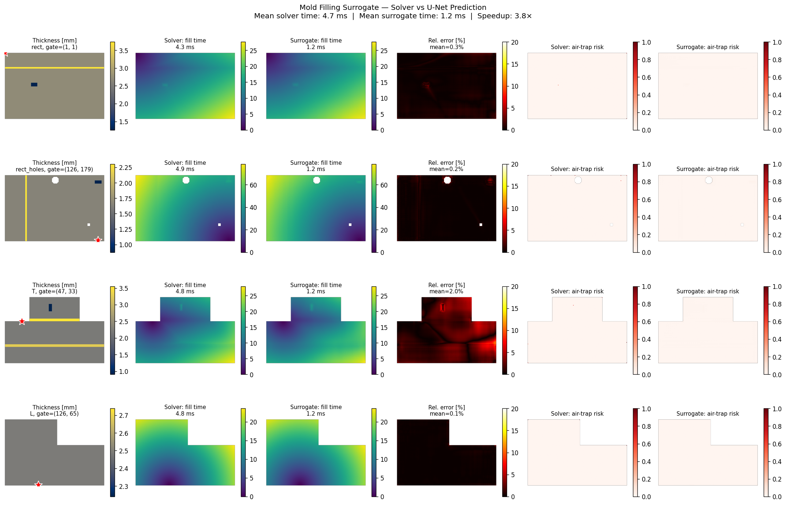

# Mold Filling Surrogate — Real-Time Injection Molding Prediction

> A neural surrogate model that predicts plastic injection mold fill time and
> air entrapment risk in milliseconds, instead of minutes. Built as a technical
> demonstrator showing the end-to-end pipeline: physics solver → synthetic
> training data → neural surrogate → interactive demo.



**Short walkthrough video** (click the thumbnail to play):

[](https://github.com/DittmannAxel/my_experiments/raw/main/mold-surrogate/assets/short_demo.mp4)

<video src="https://github.com/DittmannAxel/my_experiments/raw/main/mold-surrogate/assets/short_demo.mp4" controls muted width="640"></video>

---

## What this is

This project demonstrates how to replace a slow physics simulation with a fast
neural network "surrogate" for a real-world manufacturing problem: **plastic
injection molding**.

When a part designer wants to evaluate "where should the gate be?" or "is this
wall thickness going to cause air traps?", they typically run a Moldflow /
Cadmould / Sigmasoft simulation. Each run takes 5-30 minutes. A surrogate model
collapses that to **milliseconds**, enabling truly interactive design exploration.

The repository contains:

- A **physics solver** (Hele-Shaw eikonal approximation) that computes fill time
  and air-trap risk maps from cavity geometry
- A **parametric geometry generator** that produces randomized but
  physically-plausible plastic part shapes
- A **dataset pipeline** that pairs geometries with solver outputs
- A **U-Net surrogate** that learns to map (thickness, gate location) → (fill
  time, air risk)
- An **interactive Streamlit demo** for live side-by-side comparison
- A **batch comparison script** that produces the figure above

## What this is *not*

This is **for my personal research only**, not a Moldflow replacement. The physics is
simplified along several axes:

- **Isothermal**: no thermal boundary layer, no frozen layer growth
- **Newtonian**: no shear-thinning viscosity (real polymer melts are strongly
  shear-thinning; ignoring this overestimates fill speed in thin sections)
- **2D Hele-Shaw**: appropriate for thin-walled parts, but misses fountain flow
  and 3D effects in chunky regions
- **Single-gate, single-material, single-shot**: no family molds, no multi-shot,
  no overmolding
- **Eikonal approximation**: solves time-of-arrival rather than full pressure-
  velocity coupling. Valid for unambiguous fill paths; less accurate near
  geometric features that cause front splitting

For production use against a real CAE workflow, you'd want to migrate to
**PhysicsNeMo's FNO implementation**, train on outputs from a real solver
(OpenFOAM with Hele-Shaw module, or actual Moldflow exports), and use real
parameterized CAD families. See `CLAUDE.md` for the migration path.

---

## Quick start

```bash
# 1. Install dependencies
pip install -r requirements.txt

# 2. Generate a small dataset (~80 samples, ~2 seconds on any machine)
python src/dataset.py --n 80 --out data/sample_dataset.npz

# 3. Train the surrogate (5 epochs on CPU, ~1 minute)
python src/train.py --epochs 5 --batch-size 8

# 4. Generate side-by-side comparison figure
python demo/compare.py --n 4 --out assets/comparison.png

# 5. Launch interactive demo
streamlit run demo/interactive.py
```

## Repository layout

```
mold-surrogate/
├── README.md                  # this file
├── CLAUDE.md                  # build instructions for Claude Code
├── requirements.txt
├── src/
│   ├── solver.py              # Hele-Shaw eikonal fill-time solver
│   ├── geometry.py            # parametric plastic-part geometry generator
│   ├── dataset.py             # solver → training-data pipeline
│   ├── model.py               # U-Net surrogate architecture
│   └── train.py               # training loop with masked loss
├── demo/
│   ├── compare.py             # batch solver-vs-surrogate figure
│   └── interactive.py         # Streamlit live demo
├── data/
│   └── sample_dataset.npz     # 80-sample dataset (sandbox-generated)
├── models/
│   ├── best.pt                # trained checkpoint (5 epochs, sandbox)
│   └── history.json           # training curves
└── assets/
    └── comparison.png         # solver-vs-surrogate figure
```

---

## How the physics works

The full Hele-Shaw equation for thin-cavity injection molding:

```
∇ · (h³ / 12μ ∇p) = 0     in the filled region
v = -(h² / 12μ) ∇p          velocity field
```

For weakly-compressible isothermal filling, the time-of-arrival map τ(x,y) —
which tells you when each cell of the cavity gets filled — satisfies an
eikonal-like relationship:

```
|∇τ| ∝ 1 / h^n               n ≈ 2 for Hele-Shaw
```

We solve this efficiently with the **Fast Marching Method** starting from the
gate. Each cell's "speed" of filling is proportional to thickness². Air
entrapment is detected at local maxima of τ, where multiple flow fronts converge.

This is the same approximation Moldflow used in its early versions, before
moving to full pressure-velocity solvers. It's pedagogically clean and runs
in ~5-200 ms per geometry depending on size.

## How the surrogate works

The U-Net takes a 2-channel input image:

| Channel | Field | Range |
|---------|-------|-------|
| 0 | Wall thickness map (mm, normalized) | [0, ~1] |
| 1 | Euclidean distance from gate (normalized) | [0, ~1] |

And produces a 2-channel output:

| Channel | Field | Notes |
|---------|-------|-------|
| 0 | log(1+fill_time) | log compresses the dynamic range |
| 1 | Air-trap probability | Sigmoid-ish [0, 1] |

Architecture: 4-level U-Net, base 32 channels, ~7.7M parameters, GroupNorm +
SiLU, learned bilinear upsampling via ConvTranspose. This is small enough to
fit in a few hundred MB of GPU memory and large enough to learn the
spatial structure.

The **masked loss** is critical: we only compute MSE on cells inside the
cavity, so the network spends all its capacity on the actual prediction
problem rather than learning to output zeros outside the part.

---

## Why this is interesting for NVIDIA / Manufacturing

Three reasons this kind of surrogate matters in real industrial workflows:

1. **Design exploration becomes interactive.** A designer in NX or SOLIDWORKS
   can rough out a gate position, hit "predict", and see fill quality in real
   time. Moldflow validation runs only happen for the final candidate, not 50
   intermediate iterations.

2. **Optimization-in-the-loop.** Once a surrogate is fast and differentiable,
   you can plug it into a Bayesian or gradient-based optimizer that searches
   for "best gate location given these constraints" automatically. This is
   what generative-design tools (Autodesk, nTopology) are starting to ship.

3. **Edge deployment for in-line process monitoring.** Once trained, the
   surrogate runs on a Jetson at the press, comparing predicted-fill-pattern
   against actual sensor traces (cavity-pressure curves) and flagging
   deviations live.

This repo gives you the bones of all three. Migration to production-grade is
documented in `CLAUDE.md`.

## Migration to PhysicsNeMo

NVIDIA's [PhysicsNeMo](https://github.com/NVIDIA/PhysicsNeMo) is the right
framework for the production version. Specifically:

- **`physicsnemo.models.fno.FNO`** — a Fourier Neural Operator is more
  data-efficient than U-Net for parametric PDEs (better extrapolation to
  unseen geometries)
- **Multi-GPU training** out of the box via DDP
- **Built-in distributed dataset loaders** for HDF5/Zarr-backed mesh data
- **Physics-informed losses** if you want to add mass-conservation terms

The U-Net here is a deliberately simpler choice for understandability. See
`CLAUDE.md` for the suggested migration sequence.

---

## How to use this experiment

A surrogate is an *approximation* of the solver — fast, but with bounded error
and no built-in "I don't know" mechanism on geometries it has never seen. The
solver is slower but deterministic within its own physics assumptions. They
are complements, not replacements.

So in practice the workflow is: **use the surrogate for fast interactive
exploration of design candidates, then validate the final candidate(s) with
the slower solver before committing.**

---

## License

MIT. Use as you like, no warranty.
